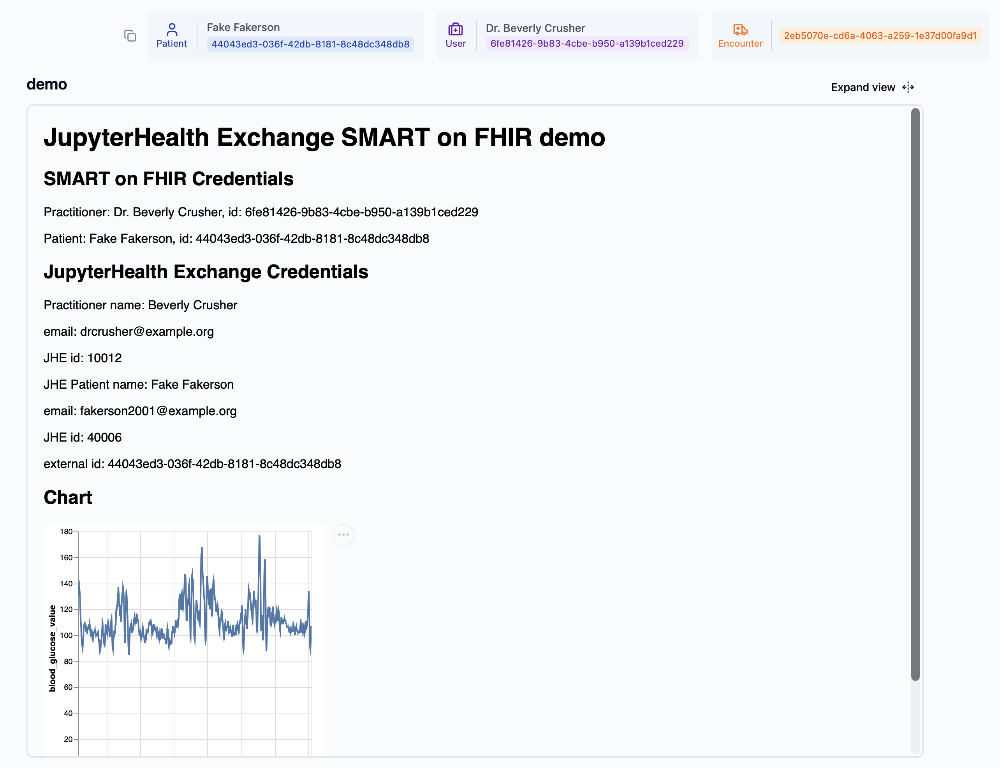

# jhe-smart-demo

demo SMART-on-FHIR app launch for fetching data from JupyterHealth Exchange



This uses docker compose to run:

- postgres database
- HAPI FHIR server
- mock EHR SMART App Launcher
- JupyterHealth Exchange
- a SMART Launch App

A fully self-contained FHIR server is deployed with one Practitioner and one Patient.
These are cloned into JupyterHealth Exchange,
with references to the FHIR resources via JHE external identifier.

A sample study is created, with sample data for this patient
loaded from https://github.com/Big-Ideas-Lab/cgm-sandbox.

## What this demonstrates

headline: Accessing data in JHE with credentials from SMART-on-FHIR launch

A mock EHR SMART launch launches the SMART on FHIR application
with Practitioner and Patient information.

This information is mapped to entities in JHE via external identifiers,
and data is retrieved for analysis/visualization.

## Run the demo

Launch:

```
docker compose up
```

seed the FHIR database:

```
python3 seed/seed_fhir.py
```

seed the JHE database:

```
cat jhe/seed.py | docker exec -i jhe-smart-demo-jhe-1 python3 manage.py shell
```

visit http://localhost:8080 and proceed through selecting practitioner, patient, and click 'launch demo'.

Click "Login with JHE" to get JHE credentials (this will become unnecessary shortly).

Then you should see info from EHR and JHE together.

## TODO

- [ ] implement token exchange instead of repeat JHE OAuth
